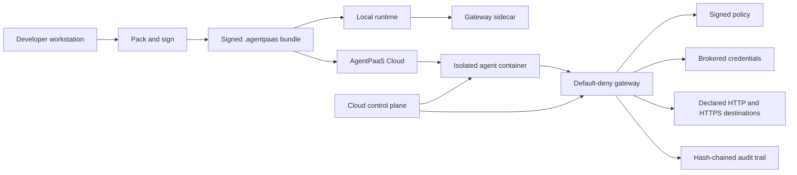

# AgentPaaS architecture

This page gives security and platform teams a high-level view of how AgentPaaS builds, admits, runs, and audits agents, MCP servers, tools, and workflows. Use it to answer architecture and security RFI questions, then follow the linked pages for control-level detail.

## Architecture at a glance

AgentPaaS packages an agent or component with its policy and publisher signature. The runtime verifies the package, starts the workload in an isolated container, and routes outbound requests through a default-deny gateway. Approved credentials are brokered at request time. Allowed and denied actions enter a hash-chained audit trail.

The same signed package can run locally and in AgentPaaS Cloud. The enforcement mechanism depends on the runtime tier. Read the [threat model](../security/threat-model) before making an isolation claim.

## What runs where

### Developer workstation

The CLI and SDK build, pack, sign, and test components. Local execution uses an isolated agent container and a gateway sidecar on an internal-only network. The network shape keeps the agent from reaching the internet except through the gateway.

Local mode trusts the developer's machine. AgentPaaS limits the agent's authority inside that environment, and the user remains responsible for the host.

### AgentPaaS Cloud

AgentPaaS Cloud runs the control plane, agent containers, gateway services, storage, and audit paths on Cloudflare's data plane. The Cloud configuration includes:

- Cloudflare D1 for control-plane database access.
- Cloudflare R2 for stored artifacts.
- Cloudflare Containers for run workloads.
- Cloudflare Durable Objects for stateful runtime coordination.
- A static dashboard served through Cloudflare assets.

The Cloud default tier enforces egress at the per-instance boundary through the control plane and gateway. The paid, on-request high-assurance tier adds substrate-enforced network policy in a dedicated Kubernetes namespace. See [How enforcement works](../security/how-enforcement-works) for the tier distinction.

## Request and data flow

A typical outbound request follows this path:

1. The agent asks to call a declared HTTP or HTTPS destination.
2. The runtime associates the request with the run and its signed policy.
3. The gateway checks the destination against the allow list.
4. The gateway obtains an approved credential when the request needs one.
5. The gateway forwards the allowed request.
6. The response returns to the agent.
7. The platform records the decision and request lineage in the audit path.

An undeclared destination is denied. A missing gateway path leaves the agent without internet access under the default-deny model. The gateway is outside the agent's trust boundary, and agent code does not hold a reusable provider key.

The governed network scope is HTTP and HTTPS. Raw TCP, UDP, and ICMP are outside the current transparent proxy model. See [Known limitations](../security/known-limitations).

## Cloudflare Durable Objects

AgentPaaS Cloud uses Cloudflare Durable Objects for stateful coordination inside the Cloud runtime. The current Cloud configuration declares:

- `SECRETS_VAULT` for the managed secrets vault path.
- `RUN_CONTAINER` and additional run-container bindings for run workload coordination.
- `SEAT_WAIT` for runs waiting for an available execution seat.

Durable Objects are one part of the runtime design. They do not replace container isolation, gateway enforcement, signed policy, or audit controls. This page does not claim that a Durable Object by itself provides tenant isolation.

## Tenant, workload, and authority boundaries

AgentPaaS applies several boundaries during a run:

- **Tenant boundary:** Cloud operations use a tenant session and tenant-scoped resources.
- **Run boundary:** A run receives its own runtime identity, policy, and execution context.
- **Workload boundary:** The agent runs inside an isolated container.
- **Network boundary:** Outbound traffic uses the gateway and declared destinations.
- **Credential boundary:** The gateway brokers approved credentials without placing raw values in agent code.
- **Delegation boundary:** Child work stays within the parent's declared authority.
- **Audit boundary:** Decisions and lineage connect actions to their run and policy.

The default Cloud tier uses control-plane and gateway enforcement at the egress boundary. It does not claim substrate-enforced isolation. The high-assurance tier provides that additional substrate boundary for tenants whose threat model requires it.

## Package admission and software supply chain

A component enters the platform as a signed `.agentpaas` package. The package carries the component and its policy. The signature provides publisher identity and package integrity. It does not establish that the component is safe to run.

Before production use, review:

- Component source and dependencies.
- Publisher identity and signature.
- Declared destinations.
- Credential bindings.
- File and tool permissions.
- Child-agent authority.
- Image and package provenance.

See [Trust model](../security/trust-model), [Identity and trust](../cli/identity-trust), and [Policy](../cli/policy).

## Credentials and secrets

AgentPaaS uses brokered credentials:

- Store secret values outside the agent process.
- Bind a credential label to an approved deployment and host.
- Let the gateway inject the credential into an approved request.
- Keep reusable secret values out of the agent environment.
- Record credential use in the governed request path.

The customer controls the provider relationship, credential scope, destination allow list, rotation, and revocation decisions. AgentPaaS controls the brokered access path and the binding check. See [Credentials and secrets](../security/credentials) and [Data handling](../security/data-handling).

## Data handling and residency

AgentPaaS Cloud currently processes and stores customer data in the **United States only**. If your organization requires another residency region, [contact us](https://agentpaas.ai/contact/) to discuss requirements and availability.

The main data categories are:

| Data category | How it is handled |
|---|---|
| Packages and metadata | Stored and used for registry, admission, and deployment operations. |
| Run metadata | Used to operate runs and connect requests to their lineage. |
| Prompts and model responses | Sent to the model provider configured for the agent, through the declared egress path. |
| Tool inputs and outputs | Move through the declared tool and network paths. Review the tool's provider terms. |
| Audit records | Record governed decisions, request lineage, and verification data. |
| Credential values | Brokered at request time. Raw values do not enter agent code. |
| Credential labels and bindings | Used to select and authorize a credential for a governed request. |
| Artifacts | Stored in the Cloud artifact path used by the service. |

AgentPaaS does not use customer prompts, files, or run content to train a model. The data policy of an external model provider remains the customer's responsibility. See [Data handling and LLM providers](../security/data-handling).

## Security controls

The architecture uses controls at different points in the request path:

| Control | What it does |
|---|---|
| Signed packages | Establish publisher identity and package integrity. |
| Isolated containers | Separate the agent process from the surrounding service runtime. |
| Default-deny egress | Deny destinations outside the declared allow list. |
| Gateway enforcement | Check outbound requests and broker approved credentials. |
| Brokered credentials | Keep raw provider credentials outside agent code. |
| Hash-chained audit | Make changes to recorded decisions detectable through verification. |
| Request lineage | Connect parent agents, child agents, model calls, tool calls, and gateway decisions. |

These controls contain an agent's blast radius. They do not prevent prompt injection, prove that agent code is safe, or replace customer review of policies, destinations, dependencies, and provider terms.

For the detailed security position, read the [threat model](../security/threat-model), [How enforcement works](../security/how-enforcement-works), and [Known limitations](../security/known-limitations).

## Observability and audit

A security reviewer can inspect:

- Run identity and status.
- Parent and child request lineage.
- Model and tool calls.
- Gateway allow and deny decisions.
- Destination and credential binding information.
- Signed and hash-chained audit records.
- Exported audit data and verification results.

Use [Audit export](../security/audit-export) for the record format and current verification limits. The current audit model detects modified records, reordered records, and inserted middle records. Tail truncation remains a documented limitation.

## Availability and responsibility boundaries

The Architecture page describes the service design. It does not create an availability, recovery, retention, or incident-notification commitment. Use the applicable service agreement for contractual values.

AgentPaaS operates the Cloud control plane, runtime, gateway, storage paths, and service infrastructure. Customers remain responsible for:

- Agent source and dependency review.
- Policy and destination design.
- Provider selection and provider data settings.
- Credential scope and rotation.
- Business-level incident response.
- Data classification and regulatory obligations.
- Selecting the isolation tier that fits the use case.

See [Compliance and attestations](../security/compliance) for current compliance status and subprocessors.

## RFI quick reference

| RFI question | Public answer |
|---|---|
| Where is Cloud data stored? | United States only at this time. Contact us about other residency requirements. |
| Which infrastructure provider hosts Cloud? | Cloudflare's data plane. |
| Does the agent have direct internet access? | No. Outbound traffic uses the gateway and declared HTTP or HTTPS destinations. |
| Where are provider credentials stored? | Outside agent code, with request-time gateway brokering. |
| What does signing prove? | Publisher identity and package integrity. It does not prove that code is safe. |
| Which tier has substrate-enforced isolation? | The paid, on-request high-assurance tier. |
| Can customers inspect security evidence? | Yes. Use the threat model, audit export, signed artifact, and known-limitations pages. |
| Does AgentPaaS claim SOC 2 certification? | No. AgentPaaS is working toward SOC 2 and is not yet certified. |

## Related pages

- [Threat model](../security/threat-model)
- [How enforcement works](../security/how-enforcement-works)
- [Known limitations](../security/known-limitations)
- [Data handling](../security/data-handling)
- [Credentials and secrets](../security/credentials)
- [Audit export](../security/audit-export)
- [Compliance and attestations](../security/compliance)
- [Gateway security controls](../trial/gateway-security)
