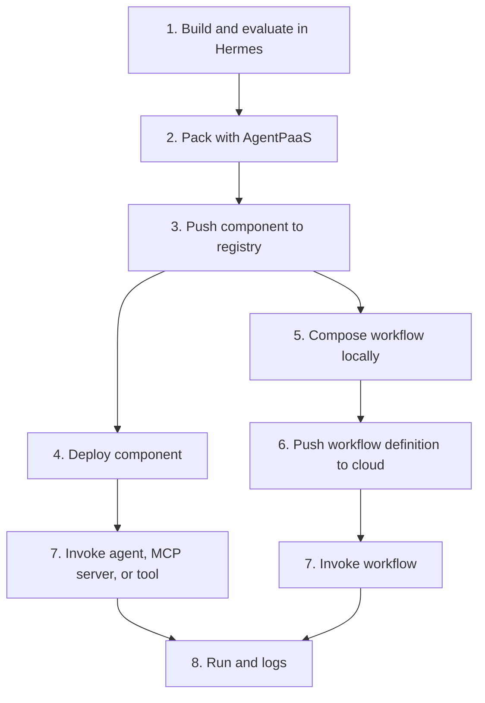

# AgentPaaS concepts

Use Hermes with the AgentPaaS SDK to build an agent, MCP server, tool, or agentic workflow from start to finish. Hermes is the authoring path and can run the AgentPaaS CLI for the operational steps.

When a component is ready, use Hermes to pack it into a Docker container. Configure the gateway sidecar and its ports as part of the component package, then run tests and evals on your Mac. For a workflow, Hermes creates the signed workflow definition from the components you built. Push the validated component packages and workflow definition to AgentPaaS Cloud, deploy the components, and invoke the workflow through Hermes and the AgentPaaS CLI.

The cloud console is a read-only view of this work. Use it to monitor components, deployments, workflows, runs, logs, governance, and audits. Build agents and workflows in Hermes with the SDK. Create, pack, push, deploy, and invoke them through Hermes and the CLI.

AgentPaaS separates the thing you build from the thing that runs. A packed component goes into the cloud registry. A deployment turns that component into live compute. A workflow connects deployed components into a signed recipe.

## Component registry

The component registry stores admitted packages for agents, MCP servers, and tools. Each package keeps its component kind, name, digest, publisher identity, and signed build metadata. The package also carries the declared egress and other policy data used when it runs.

The registry gives the cloud a known artifact to deploy. It also keeps the identity of what you pushed, so a deployment can be tied back to its package and build lineage.

A registry component is stored software. It does not run until you create a deployment.

## Deployments

A deployment is live compute created from a registry component. It has its own deployment ID and component kind. Its runtime configuration includes the allowed egress and secret bindings used by the gateway.

Deployments consume live capacity and can be invoked directly. A single agent, MCP server, or tool can run without a workflow.

Undeploying removes the live deployment and its secret bindings. A workflow definition that refers to that deployment remains stored, but a later run fails with `deployment_not_found` until the component is deployed again and its bindings are restored.

## Workflows

A workflow is a signed recipe that connects components. It stores the stages, their order or control structure, and the deployment IDs each stage uses at runtime.

A workflow is not live compute. Deploy the member components first. Then push the workflow definition to the cloud and invoke it. The workflow run appears under **Runs**, and its execution records appear under **Logs**.

## How it all works together

1. Build an agent, MCP server, tool, or agentic workflow in Hermes with the AgentPaaS SDK.
2. Pack each agent, MCP server, or tool component into a Docker container with Hermes.
3. Configure each component's gateway sidecar and verify the ports it needs.
4. Run tests and evals on your Mac.
5. Push the validated component packages to the cloud component registry.
6. Deploy the components.
7. Push the signed workflow definition to the cloud when the task needs more than one step.
8. Invoke the component or workflow through Hermes or the AgentPaaS CLI.
9. Inspect the run, logs, governance records, and audit evidence in the cloud console.

The console does not build agents or workflows. Use Hermes or the CLI to create, pack, push, deploy, and invoke. See [What is AgentPaaS?](what-is-agentpaas.md), [Workflows](workflow-kinds-and-edges.md), and [Build a workflow](workflows.md) for the next steps.

## Console objects

The cloud console shows the objects created by Hermes or the CLI:

- **Components** shows admitted packages in the registry.
- **Deployments** shows live component instances.
- **Workflows** shows signed workflow recipes.
- **Runs** shows standalone invocations and workflow executions.
- **Logs** shows execution and policy records.

See [Platform limits](platform-limits.md) before composing a workflow.
