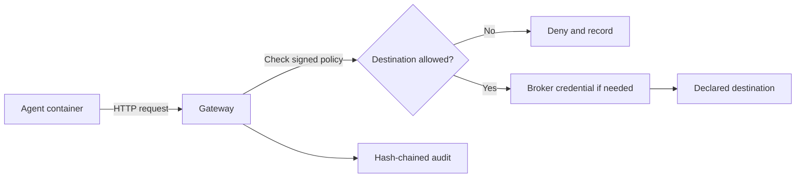

# AgentPaaS Gateway

The AgentPaaS Gateway is the runtime boundary between an agent and the systems it can reach. It applies the signed policy for the run before traffic leaves the agent, brokers approved credentials per request, and records allow and deny decisions for audit.

Build and test your agent, MCP server, tool, or workflow locally. When you pack a component, AgentPaaS configures the agent and gateway as one governed runtime. The workflow moves to AgentPaaS Cloud as a signed package and runs under the same policy model.

## The request path

An agent has no direct route to the internet. Its outbound request goes through the gateway. The gateway checks the destination against the declared allow list, obtains an approved credential when the request needs one, forwards allowed traffic, and records the decision.

The gateway is outside the agent's trust boundary. Agent code does not hold a long-lived provider key. A request can leave only through an approved gateway path.

## Where the gateway runs

- **Local runtime:** each agent run gets an isolated agent container and a gateway sidecar on an internal-only network. Network topology provides the hard boundary.
- **AgentPaaS Cloud default tier:** the per-instance egress policy and gateway enforce the boundary at the egress path through the control plane. This tier does not claim substrate-enforced isolation.
- **High-assurance Cloud tier:** a paid, on-request tier adds substrate-enforced network policy in a dedicated Kubernetes namespace.

The assurance mechanism differs by tier. Read the [threat model](../security/threat-model) before making a deployment claim.

## Start here

- [Gateway security controls](./gateway-security)
- [Gateway roadmap](./gateway-roadmap)
- [How enforcement works](../security/how-enforcement-works)
- [Known limitations](../security/known-limitations)
