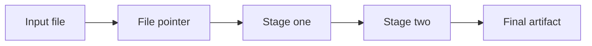

# Platform limits

Limits are part of the workflow design. Check them before packing.

## Capacity

A slot is one warm container for one deployment. The trial allows 10 live deployments and 5 concurrent runs. A three-agent workflow uses three slots when its three components are deployed. The workflow definition itself uses no slot. Undeploy a component to free its slot.

## Payloads and files

Input files are limited to 50 MiB at the workflow boundary and API request bodies to 10 MiB. A file pointer can pass a file through stages without embedding the file in every envelope. Keep the source file available to the component that consumes the pointer.

## Unsupported paths

Native human-in-the-loop, for-each, wait or delay, local multi-stage runs, join-any, spawn depth greater than one, and an undeclared standalone agent-to-agent call are unavailable. Use a declared pipeline, fan-out with join-all, choice, or a declared phone call. If a requested fact is not present in the installed CLI help or API source, verify it before relying on it.

## File-through

Pass a pointer when a file must move through stages. Keep the file within the limits of the API and workflow boundary.

