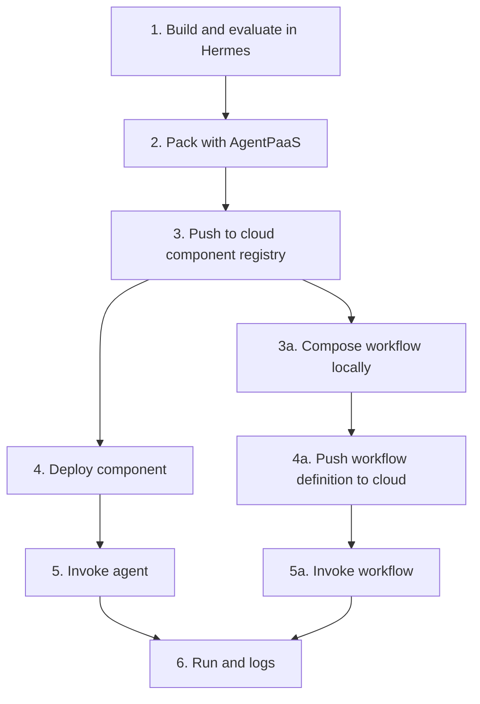

# What is AgentPaaS?

AgentPaaS.ai is the secure PaaS for agents, apps, MCP servers, and agentic workflows. You can deploy your enterprise agentic integration workflows securely at scale, with end-to-end auditability and governance.

## Why Agentic workflows are harder to secure?

Non-deterministic workflows, also called agentic workflows, are inherently harder to secure because agents can choose actions at runtime. Prompt hacking can redirect an agent, generated code or dependencies can introduce malicious behavior, and exposed credentials can leak through tool calls or outbound requests. Agents can also access data they should not see, use tools in unsafe ways, or make changes that are difficult to trace.

## What is the security exposure?

A redirected agent or an agent with excessive access can turn a model-level error into an enterprise security incident. Possible impacts include unauthorized data access, credential exposure, unapproved changes in connected systems, and loss of confidence in the affected workflow's outputs. Investigation also becomes harder when actions are difficult to trace.

Treat agentic workflows as production workloads. Define their allowed network destinations and required secrets, limit permissions to the task, review packages and dependencies, and retain audit exports for incident investigation. AgentPaaS reduces the agent's blast radius through the controls below. It does not replace application authorization, data classification, approval requirements for high-impact actions, or your incident response process.

## How does AgentPaaS contain the risk?

AgentPaaS runs agents in an isolated container, on a default-deny network, with gateway-brokered credentials and a tamper-evident audit trail.

The four controls are:

- Isolated container
- Default-deny egress
- Gateway-brokered credentials
- Tamper-evident audit

## Here is how you can use AgentPaaS:

1. **Build and evaluate locally.** Build your agent in Hermes, then test it and evaluate its behavior in your own environment.
2. **Pack it with AgentPaaS.** When the agent is ready, pack it with AgentPaaS. Confirm that its declared egress and required secrets work before sending it to the cloud.
3. **Push the component to the cloud.** AgentPaaS pushes the signed package to the cloud component registry.
4. **Deploy the component.** Deploy the component to make it available for invocation.
5. **Invoke the agent.** Run the deployed agent when you are ready to execute it.
6. **Inspect the run logs.** Each invocation creates a run, and the platform records logs and audit evidence for that run.

Try now: [Agent Guided Demo](guided-demo.md).

Workflows follow the same path. Build and evaluate each agent in Hermes, pack each component with AgentPaaS, and push the components to the cloud component registry. Compose the workflow from those registry components, deploy the components it needs, then invoke the workflow. The workflow run appears under **Runs**, and its execution records appear under **Logs**.

The working pattern is simple: build securely in your own environment, then push to AgentPaaS Cloud when you are ready to run and scale agentic workflows. The number of live deployments and concurrent runs depends on your trial or plan limits. See [platform limits](platform-limits.md) before composing a workflow.

A single agent, MCP server, or tool application does not need a workflow. Build and test it in Hermes or your own environment, pack it with AgentPaaS, push its component to the cloud registry, deploy it, and invoke the deployment. The weather demo follows this single-agent path.

Use a workflow when a task needs more than one step. A step can be an agent or a tool. The workflow can run one component after another, choose a branch, fan out work, or make a phone call to another agent. Compose the workflow locally from its components, then pack and push the components, deploy every member component, and push the workflow definition to the cloud. Invoke the workflow after its member components are deployed. The workflow is a recipe, not a deployment. See [workflows](workflows.md) for the details.

The console is read-only. Use Hermes or the CLI to create, pack, deploy, and invoke. Open **Logs** in the console to inspect execution records. In this documentation, **Audit** names the evidence trail for the four controls.

> **Note:** You can build any agent with Hermes on your Mac. Windows support is coming.

See [workflow kinds and edges](workflow-kinds-and-edges.md) and [platform limits](platform-limits.md) before composing a workflow.
