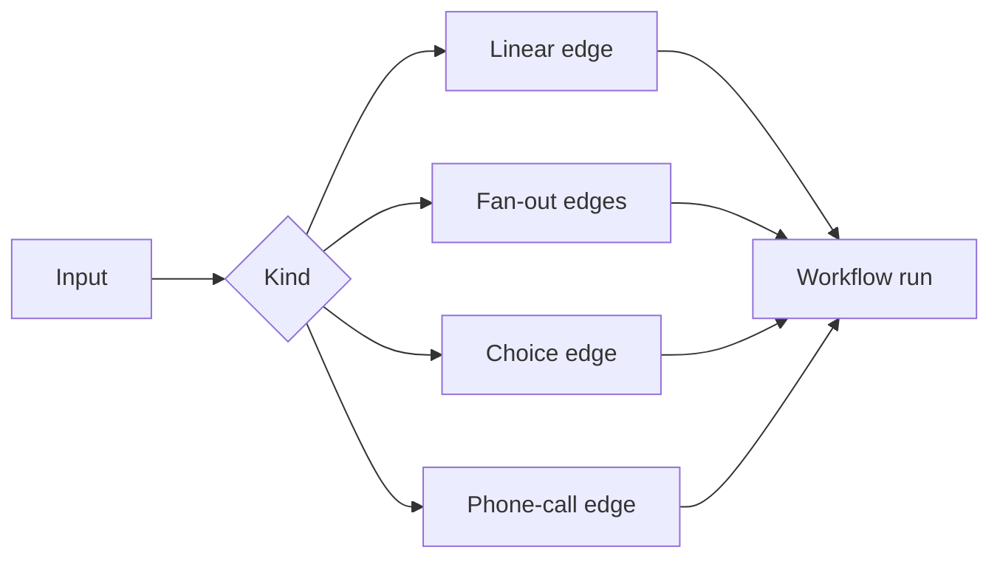

# Workflows

Workflows are signed recipes. They are stored under Workflows, do not take slots, and run only when their member deployments are ready.

| Kind | Use it for | Edge behavior |
|---|---|---|
| Linear | A then B | The next stage receives the prior result. |
| Fan-out | Several specialists in parallel | The parent waits for all selected branches. |
| Choice | One selected branch | The condition selects the matching specialist. |
| Phone call | A living agent calls B | The call must be declared in the envelope and both deployments must be ready. |

Children are deployed before the parent. A standalone agent cannot call another agent outside the envelope. There is no for-each, wait, delay, join-any, or native human-in-the-loop path in this release. A local multi-stage `agentpaas run` is fail-closed; use the cloud envelope path for staged execution.
