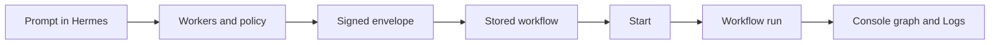
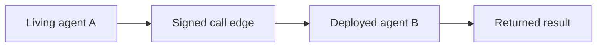

# Build a workflow

> **Use Hermes for the whole flow:** Ask Hermes to build a workflow and it can run the AgentPaaS CLI commands for composing, pushing, starting, and inspecting it. You still approve cloud login in your browser and enter private credentials in your Terminal when prompted.

Use a workflow when a task needs more than one step. Build and evaluate the member agents or tools locally, deploy those components, then create and push the signed workflow definition.

## Authoring path

1. Tell Hermes what the workflow should do.
2. Let Hermes write the workers and signed envelope.
3. Show the Mermaid graph and confirm it.
4. Pack and push the components.
5. Deploy children first, then the parent component.
6. Resolve real component, deployment, and workflow IDs from the API.
7. Start once on a cold walkthrough.

Use this prompt:

> Build a support workflow. Classify the ticket as refund, escalate, or close, then run only the matching specialist.

A workflow is a recipe. A deployment is live compute. A run is one execution. Do not deploy a workflow. Ready means every member component is already deployed. The console graph is read-only.

The default is a pipeline. A phone call is for a living agent that must call another living agent. A call outside the signed envelope fails closed.

See [Workflows](workflow-kinds-and-edges.md), [MCP servers](mcp-servers.md), [Tools](tools.md), and [Platform limits](platform-limits.md).

## Phone-call shape

Use a phone call only when the parent agent must stay alive while a named teammate works.

